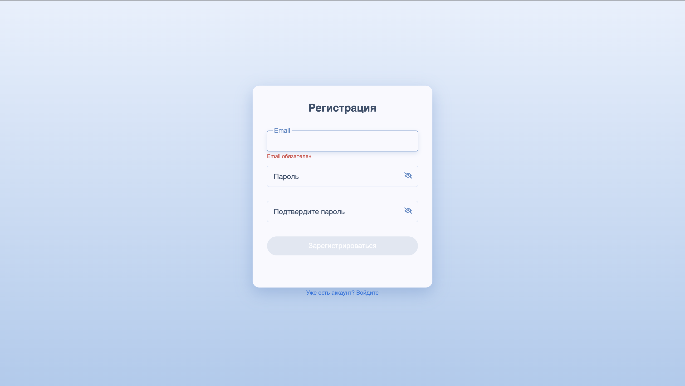
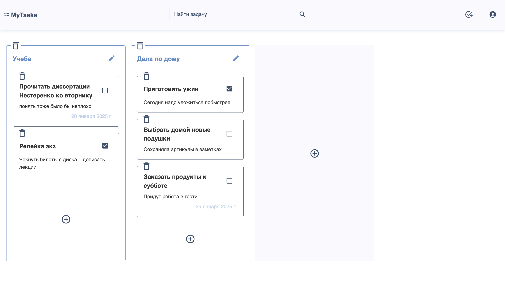

# (в разработке) Пет-проект: таск менеджер

Стек: React, TypeScript, Redux Toolkit, Styled Components, Vite

## Страница регистрации



## Главная



## Что было сделано

В рамках проекта были решены следующие задачи:

-   создана серверная часть приложения при помощи Supabase
-   настроен роутинг и маршрутизация
-   настроен стейт менеджер
-   реализован процесс авторизации пользователя
-   реализован функционал добавления, редактирования и удаления карточек с задачами
-   реализован функционал добавления, редактирования и удаления досок
-   реализован самописный ui-kit
-   для оптимизации ui/ux используются прелоадеры

## В разработке

Сейчас работаю над следующими задачами:

-   улучшение адаптивности интерфейса
-   реализация страницы профиля
-   реализация логики поиска задач
-   улучшение плавности интерфейса
-   возможность перемещать задачи между досками и менять задачи на доске местами
-   сортировка задач внутри доски

## Установка и запуск

1. Создайте в корне проекта файл `.env.local` с содержимым файла `.env.example`
2. Установите зависимости и запустите проект:

```
npm install
npm run dev
```
